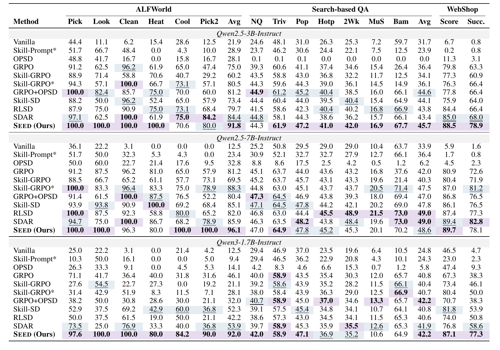

<h1 align="center">

SEED: Self-Evolving On-Policy Distillation for Agentic Reinforcement Learning
</h1>

<p align="center">
  <a href="https://jinyangwu.github.io/seed/">
    
  </a>
  <a href="https://huggingface.co/papers/2607.14777">
    
  </a>
  <a href="https://arxiv.org/abs/2607.14777">
    
  </a>
  <a href="https://huggingface.co/Jinyang23/Seed-AlfWorld-3B">
    
  </a>
</p>

## News

- **2026-07-16**: We have released our paper and code.

If you have any questions ❓ or are interested in collaboration 🤝, please feel free to contact me at 
wu-jy23@mails.tsinghua.edu.cn.

## Overview

**SEED** is a **Self-Evolving On-Policy Distillation** framework for long-horizon
LLM agents. Its core idea is to make one policy checkpoint play two synchronized
roles: it acts in the environment to collect on-policy trajectories, then analyzes
its own completed trajectories into hindsight skills, and finally distills the
skill-induced change in action probabilities back into the ordinary policy. After
each update, the improved policy becomes the next analyzer and generates the next
round of hindsight skills, so the decision policy and hindsight supervision
evolve together.

SEED has two stages:

1. **Hindsight-skill SFT.** Collect ordinary agent trajectories, annotate each
   completed trajectory with an episode-level hindsight skill, and fine-tune the
   backbone so the same model can analyze trajectories.
2. **Self-evolving OPD during RL.** At each RL update, the frozen current policy
   both samples on-policy trajectories and serves as the synchronized analyzer
   that extracts hindsight skills. The same sampled action tokens are re-scored
   under ordinary and skill-augmented contexts. The skill-induced log-probability
   shift gates a dense OPD loss, which is optimized jointly with GRPO.

At inference time, SEED uses only the learned policy. It requires no analyzer,
no skill bank, no retrieval module, and no skill-augmented prompt at deployment.

<div align="center">
  
  <br>
  <em>Figure 1: Overview of SEED.</em>
</div>

## Main Results

Across ALFWorld, Search-based QA, and WebShop, the experiments show three main
findings:

1. **Dense hindsight supervision improves outcome-only RL.** SEED consistently
   outperforms GRPO by converting trajectory-level hindsight into token-level
   OPD signals.
2. **Internalizing skills is better than prompting with skills.** SEED uses
   hindsight skills only during training and still outperforms skill-prompted
   evaluation baselines.
3. **Self-evolving distillation beats static distillation.** Refreshing the
   analyzer from the latest policy keeps hindsight supervision aligned with the
   policy's evolving behaviors and failure modes.

<div align="center">
  
  <br>
  <em>Figure 2: Main results.</em>
</div>

## Installation

### Install veRL

```bash
conda create -n seed python==3.12 -y
conda activate seed

pip3 install vllm==0.11.0
pip3 install flash-attn==2.7.4.post1 --no-build-isolation --no-cache-dir
pip install -e .
```

### Install Supported Environments

#### 1. ALFWorld

```bash
pip3 install gymnasium==0.29.1
pip3 install stable-baselines3==2.6.0
pip3 install alfworld
```
Download PDDL & Game files and pre-trained MaskRCNN detector (will be stored in ~/.cache/alfworld/):
```bash
alfworld-download -f
```
#### 2. WebShop

WebShop requires Python <= 3.10, so begin by creating a separate environment:

```bash
conda create -n seed-webshop python==3.10 -y
conda activate seed-webshop

cd ./agent_system/environments/env_package/webshop/webshop
./setup.sh -d all

cd repo_root/
pip3 install torch==2.6.0 --index-url https://download.pytorch.org/whl/cu124
pip3 install flash-attn==2.7.4.post1 --no-build-isolation
pip3 install -e .
pip3 install vllm==0.8.2
```

On H20 machines, the WebShop launchers reuse the prepared assets from
`/data/zhangdw12/work/verl-agent/agent_system/environments/env_package/webshop/webshop`
by default. After activating the intended mamba environment, run any
`examples/seed_trainer_{1.5b,3b,7b}/run_webshop.sh` directly. If a required
repository-local data file or `search_engine/indexes` is absent, the launcher
creates an idempotent symbolic link to the shared copy; existing local paths
are never replaced. Concurrent first launches are serialized, failed attempts
roll back their new links, and the bootstrap verifies non-empty JSON files plus
a usable Lucene index. Override the prepared checkout with
`WEBSHOP_SHARED_ROOT=/path/to/webshop`. If the shared assets are unavailable,
the launcher exits before preprocessing or training and points to `setup.sh`.
`LAUNCHER_DRY_RUN=true` never creates these links.


## Training

The `exp/iclr` branch evaluates **SEED without SFT**. Every run starts directly
from the corresponding original Qwen2.5 Instruct checkpoint while retaining
SEED's online hindsight analysis, teacher rescoring, and OPD update.

```bash
bash examples/seed_trainer_1.5b/run_alfworld.sh
bash examples/seed_trainer_3b/run_webshop.sh
bash examples/seed_trainer_7b/run_alfworld.sh
```

The six standalone launchers cover Qwen2.5 1.5B, 3B, and 7B on ALFWorld and
WebShop under the canonical fairness and shared ICLR training contract. See
`examples/README.md` for runtime paths and exact hyperparameters.

## Merge Checkpoints

See `scripts/model_merger.py` for FSDP/Megatron merge examples using paths under
`./checkpoints/...`.

## ⭐ Citation

If you find this project useful, welcome to cite us.

```bibtex
@article{wu2026seed,
  title={SEED: Self-Evolving On-Policy Distillation for Agentic Reinforcement Learning},
  author={Wu, Jinyang and Yang, Shuo and Lu, Zhengxi and Zhang, Fan and
          Shen, Yuhao and Feng, Lang and Luo, Haoran and Lian, Zheng and
          Zhang, Shuai and Wen, Zhengqi and Tao, Jianhua},
  journal={arXiv preprint arXiv:2607.14777},
  year={2026}
}
```

## Acknowledgement

This project builds on
[veRL](https://github.com/volcengine/verl),
[verl-agent](https://github.com/langfengQ/verl-agent),
[SDAR](https://github.com/ZJU-REAL/SDAR),
and
[OPID](https://github.com/jinyangwu/OPID). We thank the authors of those
projects.
